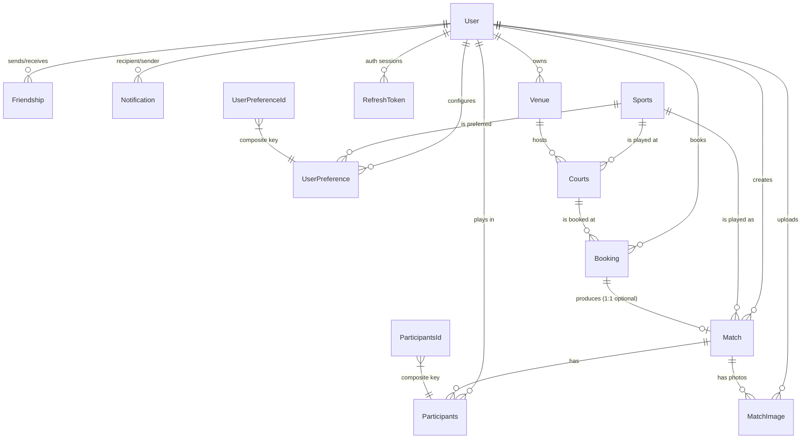

# Model Layer Overview

Quick reference for entities and their relationships. View the Mermaid diagram
below directly on GitHub, in IntelliJ (Mermaid plugin), or paste into
[mermaid.live](https://mermaid.live).

For a live-DB view of the same shape, connect DBeaver to
`localhost:5432 / sportsapp` and right-click the `public` schema →
**View Diagram**.

---

## Entity-relationship diagram

---

## Entity summary

| Entity | Primary key | Key fields | What it represents |
|---|---|---|---|
| **User** | `id` (UUID) | email (unique), username (unique), password (hashed, WRITE_ONLY), role, googleId | A user account — player, vendor, or admin |
| **Sports** | `id` (UUID) | sportName (unique), minPlayer, maxPlayer, scoringType, iconURL | The catalog of supported sports |
| **Venue** | `id` (UUID) | owner (User), name, address, **`location` (geometry Point 4326)**, openingHours (JSONB), amenities | A physical place hosting one or more courts |
| **Courts** | `id` (UUID) | venue, sports, courtNumber, hourlyRate, isIndoor, surfaceType | A bookable court at a venue, for one sport |
| **Booking** | `id` (UUID) | user, court, startTime, endTime, status, totalPrice, payment_* | A reservation of a court for a time window |
| **Match** | `id` (UUID) | sport, createdByUser, booking (nullable), source, verificationStatus, score, winningTeam, **`ratingsApplied`** | A played match, manual or from a booking |
| **Participants** | composite (`matchId`, `userId`) | teamName, status, isHost | A player's role in a specific match |
| **UserPreference** | composite (`userId`, `sportId`) | eloRating, matchesPlayed, matchesWon, isPrimarySport, opponent filters, availability flags | A user's per-sport profile, Elo, and matchmaking filters |
| **Friendship** | `id` (UUID) | requester, receiver, status, message | Friend graph; unique on (requester, receiver) |
| **Notification** | `id` (UUID) | recipient, sender (nullable), type, referenceId, message, isRead | In-app notifications |
| **RefreshToken** | `id` (UUID) | userId, tokenHash (SHA-256), expiryDate, revoked | Refresh-token rotation (token plaintext is never stored) |
| **MatchImage** | `id` (UUID) | match, uploadedBy, imageUrl (https only), caption | Photo URLs attached to a match |

---

## Composite-key entities (the tricky ones)

Two entities use composite keys because they're natural many-to-many joins
with attributes:

### `UserPreference` ← `UserPreferenceId(userId, sportId)`

One row per (user, sport) pair. A user with three sports has three rows.
Annotated with `@MapsId` so the `@ManyToOne User` and `@ManyToOne Sports`
references share columns with the embedded id (no duplicate columns).

### `Participants` ← `ParticipantsId(matchId, userId)`

One row per (match, user) pair. Same `@MapsId` pattern.

---

## Relationships in plain English

- **User** is the social/auth root. Most entities link back to it.
- **Sports** is a small lookup table seeded at boot from
  [`seed/sports.json`](src/main/resources/seed/sports.json).
- **Venue** owns many **Courts**; each Court is for exactly one Sport.
- **Courts** are what get **Booked**.
- A **Booking** optionally produces a **Match** (one-to-one). Manual matches
  exist without a booking.
- A **Match** has many **Participants** (split into TEAM_A / TEAM_B) and many
  **MatchImage** entries (photo attachments).
- **UserPreference** is the per-sport profile: Elo, matchmaking filters, primary
  sport flag, recent-activity timestamp.
- **Friendship** is a directed pending/accepted edge between two users.
- **RefreshToken** powers stateful token rotation; only the hash is stored.
- **Notification** is the in-app inbox; can be system-sent (sender null).

---

## Spatial: where `Point` lives

Only **Venue** has a geometry column: `location geometry(Point, 4326)`.
This is queried by:

- `VenueRepository.findNearbyWithDistance(...)` — radius search with distance.
- `VenueRepository.findNearbyForSports(...)` — same, filtered by user's
  preferred sports.
- `SportsRepository.findActiveSportsNearby(...)` — sports that have at least
  one court within a radius (powers "discover sports near you").

There is a GIST index `idx_venues_location` on `venues.location` that all
these queries use via `ST_DWithin`.

---

## Where to look in the codebase

| Layer | Path |
|---|---|
| Entities | `src/main/java/com/parth/sportsapp/sportsbackend/model/` |
| Composite-key embeddables | `UserPreferenceId.java`, `ParticipantsId.java` |
| Repositories | `src/main/java/com/parth/sportsapp/sportsbackend/repository/` |
| Native spatial SQL | `VenueRepository.java`, `SportsRepository.java` |
| Schema seed | `src/main/resources/seed/sports.json` |
| Hibernate DDL (auto-generated) | watch boot logs with `show-sql: true` |
