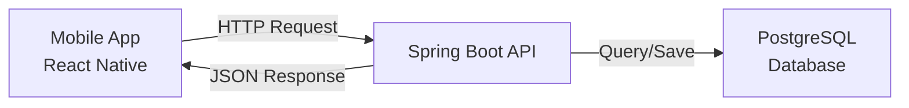

```markdown
# 🏟️ SportsApp Backend

A robust backend service for a sports venue booking application. Built with **Spring Boot** and **PostgreSQL**, designed to serve a React Native mobile frontend.

> **Created by:** Parth Aditya

---

## 🛠️ Tech Stack

* **Language:** Java 17+
* **Framework:** Spring Boot 3.x
* **Database:** PostgreSQL
* **Security:** Spring Security & JWT (JSON Web Tokens)
* **Build Tool:** Maven
* **Tools:** Docker, Postman, IntelliJ IDEA

---

## 📐 Architecture & Flow

The application follows a standard **Controller-Service-Repository** architecture.



### Authentication Logic (The "Brain")

The `AuthService` orchestrates the security flow:

1. **Validate:** Checks if Email/Phone already exists in DB.
2. **Secure:** Hashes passwords using `BCryptPasswordEncoder`.
3. **Store:** Saves the `User` entity to PostgreSQL.
4. **Tokenize:** Generates a **JWT** via `JwtUtil`.
5. **Response:** Returns the Token + User Profile to the frontend.

---

## 🚀 Getting Started

### Prerequisites

* Java 17 or higher
* PostgreSQL installed and running
* Maven

### 1. Database Setup

Ensure your `application.properties` matches your local PostgreSQL credentials:

```properties
spring.datasource.url=jdbc:postgresql://localhost:5432/sports_db
spring.datasource.username=your_username
spring.datasource.password=your_password

```

### 2. Run the Backend

Open your terminal in the project root:

```bash
# Using Maven Wrapper (Windows)
.\mvnw spring-boot:run

# Using Maven Wrapper (Mac/Linux)
./mvnw spring-boot:run

```

* **Server runs on:** `http://localhost:8080`
* **Swagger UI:** `http://localhost:8080/swagger-ui/index.html` (Once dependency is added)

### 3. Run the Frontend (Planned)

* *Note: Frontend is currently in development.*
* **Standard Command:** `npm start` inside the mobile app folder.
* **Emulator Config:** Android Emulator uses `10.0.2.2` to access localhost.

---

## 🔌 API Endpoints

### Authentication (`/auth`)

| Method | Endpoint | Description |
| --- | --- | --- |
| `POST` | `/auth/register` | Register a new user (Player). |
| `POST` | `/auth/login` | Login and receive JWT. |
| `POST` | `/auth/register/vendor` | (Future) Register a venue owner. |

### Venues (`/api/venues`) - *Coming Soon*

| Method | Endpoint | Description |
| --- | --- | --- |
| `GET` | `/venues` | List all available sports venues. |
| `POST` | `/venues` | Add a new venue (Vendor only). |

---

## 📅 Development Roadmap & Status

### Phase 1: Backend Core (In Progress) 🚧

* [x] Set up Spring Boot & PostgreSQL connection
* [x] Create User Entity & Repository
* [x] Implement JWT Utility & Security Config
* [x] Build Auth Service (Register/Login logic)
* [ ] Build Authentication Controller
* [ ] Test with Postman

### Phase 2: Venue Management (Next)

* [ ] Create Venue Entity
* [ ] Build Venue CRUD APIs

### Phase 3: Frontend (Future)

* [ ] Initialize React Native project
* [ ] Connect Axios to Backend APIs

---

### 📝 Developer Log

* **17/12/25:** Set up JWT, DTOs, and Service layer. Validated password hashing flow.
* **Next:** Setting up Controllers to expose the API.

```

```

## 🐳 Docker Setup (For New Developers)

If you don't want to install Java/Maven locally, you can run the entire backend + database inside Docker.

### 1. Prerequisites
* **Docker Desktop:** Download and install it [here](https://www.docker.com/products/docker-desktop/).
* **Git:** To clone the repo.

### 2. Secrets Setup (Crucial!)
Since `application-secrets.properties` is ignored by Git for security, you must create it manually.
1. Navigate to `src/main/resources/`.
2. Create a file named `application-secrets.properties`.
3. Paste the following (ask the Lead Dev for real values):

```properties
# Email Config (Gmail App Password)
spring.mail.username=your-email@gmail.com
spring.mail.password=your-app-password

# JWT Secret (Must be 32+ chars)
jwt.secret=404E635266556A586E3272357538782F413F4428472B4B6250645367566B5970


# Builds the JAR inside Docker and starts App + DB
docker-compose up --build

Command,Description
docker-compose up,Starts existing containers (Fast).
docker-compose up --build,Recompiles code and starts containers (Run this if you changed Java code).
docker-compose down,Stops and removes containers.
docker-compose down -v,WARNING: Deletes the database data volume (Resets DB).
